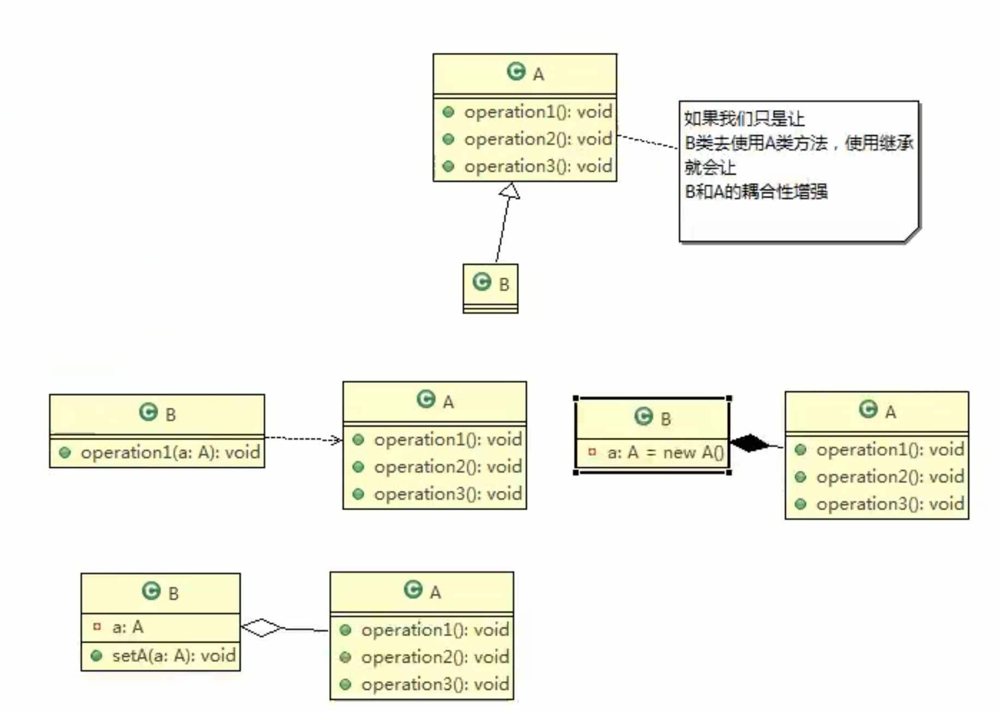
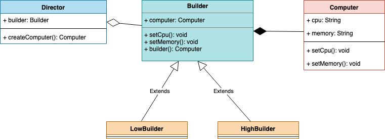
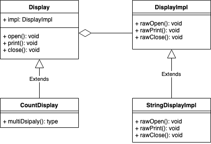
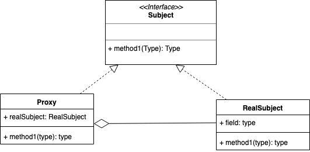

[尚硅谷图解Java设计模式韩顺平老师2019力作](https://www.bilibili.com/video/av57936239/?p=16)
[设计模式](http://c.biancheng.net/view/1390.html)

### 设计模式原则：
1、单一职责

2、接口隔离

3、依赖倒转：面向接口编程，抽象不应该依赖细节，细节应该依赖抽象

4、里氏替换：尽量不要覆盖父类方法

5、开闭原则OCP

6、迪米特法则：最少知道原则；直接朋友

7、合成复用原则：尽量使用合成、聚合的方式，而不是使用继承

### UML

- 依赖（dependency）：类中用到了对方、类的成员属性、方法的返回类型、方法接收的参数类型、方法中使用到

- 继承（泛化）：依赖的特例

- 实现

- 关联(association)：类与类之间的联系；具有导航性；一个人对应一个身份证，一个身份证对应一个人

- 聚合(aggregation)：关联关系的特例；整体和部分的关系；可分离

- 组合(composition)：关联关系的特例；整体和部分的关系；不可分离

### 创建型（5种）

#### 单例模式
一共8种写法

#### 简单工厂模式（Simple Factory）
> 简单地说，简单工厂模式通常就是这样，一个工厂类 XxxFactory，里面有一个静态方法，根据我们不同的参数，返回不同的派生自同一个父类（或实现同一接口）的实例对象。

#### 工厂方法模式（Factory Method）
> 之所以需要引入工厂模式，是因为我们往往需要使用两个或两个以上的工厂。
> 将对象的实例化推迟到子类

#### 抽象工厂模式（Abstract Factory）
> 当涉及到产品族的时候，就需要引入抽象工厂模式了。
> 比如生产电脑不再定义 CPU 工厂、主板工厂、硬盘工厂、显示屏工厂等等，我们直接定义电脑工厂，每个电脑工厂负责生产所有的设备，这样能保证肯定不存在兼容问题。

#### 原型模式
- 浅拷贝
- 深拷贝：第一种重写clone方法、第二种序列号

#### 建造者模式
product,builder,concrete builder,director

### 结构型（7种 ）

#### Adapter (适配器模式)

> 将一个类的接口转换成客户希望的另外一个接口，使得原本由于接口不兼容而不能一起工作的那些类能一起工作

- 类适配器（使用继承的适配器）
.png)
- 对象适配器（使用委托的适配器）
.png)
- 接口适配器

#### Bridge (桥接模式)

> 将抽象与实现分离，使它们可以独立变化。它是用组合关系代替继承关系来实现的，从而降低了抽象和实现这两个可变维度的耦合度

1、类的功能层次接口: 父类具有基本功能、在子类中增加新的功能
2、类的实现层次结构：父类通过声明抽象方法来定义接口（API）、子类通过实现具体方法来实现接口（API）

分离两种类的层次结构，有利于独立地对他们进行扩展。

#### Decorator (装饰者模式)

装饰边框与被装饰物具有了相同的方法。

#### Composite (组合模式)

> 将对象组合成树状层次结构，使用户对单个对象和组合对象具有一致的访问性; 能够使容器与内容具有一致性，创造出递归结构的模式

Leaf: 该角色不能放入其他对象
Composite: 表示容器的角色, 可以放入leaf和Composite
Component: 使leaf角色和Composite角色具有一致性

#### Facade (外观模式)

> 为多个复杂的子系统提供一个一致的接口，使这些子系统更加容易被访问

#### Proxy (代理模式)

> 提供了间接对目标对象进行访问的方式;即通过代理对象访问目标对象.这样做的好处是:可以在目标对象实现的功能上,增加额外的功能补充,即扩展目标对象的功能

Subject: 
RealSubject: 
Proxy: 

- 静态代理: 真实主题与代理主题一一对应，增加真实主题也要增加代理。设计代理以前真实主题必须事先存在，不太灵活
- 动态代理: TODO

#### Flyweight (享元模式)

> 共享对象，避免浪费；相同对象只要保存一份，这降低了系统中对象的数量，从而降低了系统中细粒度对象给内存带来的压力。

五子棋游戏应用

### 行为型（11种）

#### Template Method（模板方法）

> 将具体处理交给子类； 定义一个操作中的算法骨架，而将算法的一些步骤延迟到子类中，使得子类可以不改变该算法结构的情况下重定义该算法的某些特定步骤。它是一种类行为型模式。

#### Strategy (策略模式)

> 该模式定义了一系列算法，并将每个算法封装起来，使它们可以相互替换，且算法的变化不会影响使用算法的客户。策略模式属于对象行为模式，它通过对算法进行封装，把使用算法的责任和算法的实现分割开来，并委派给不同的对象对这些算法进行管理。

案例：猜拳游戏，第一种策略“如果如果这局获胜，那么下一句出一样的手势”；第二种策略“根据上一局的手势从概率上计算下一局的手势”

Strategy: 
ConcreteStrategy: 
Context: 负责使用Strategy的角色

#### Command (命令模式)

#### Chain of Responsibility (责任链模式)

> 推卸责任，将多个对象组成一条职责链，然后在职责链上找出谁该执行

缺点：
- 不能保证每个请求一定被处理。由于一个请求没有明确的接收者，所以不能保证它一定会被处理，该请求可能一直传到链的末端都得不到处理。
- 对比较长的职责链，请求的处理可能涉及多个处理对象，系统性能将受到一定影响。
- 职责链建立的合理性要靠客户端来保证，增加了客户端的复杂性，可能会由于职责链的错误设置而导致系统出错，如可能会造成循环调用。

#### Observer (观察者模式)

> 指多个对象间存在一对多的依赖关系，当一个对象的状态发生改变时，所有依赖于它的对象都得到通知并被自动更新

Subject: 抽象目标
ConcreteSubject: 当具体主题的内部状态发生改变时，通知所有注册过的观察者对象
Observer: 
ConcreteObserver: 存在多个

#### State (状态模式)

> 用类表示状态；把复杂的“判断逻辑”提取到不同的状态对象中，允许状态对象在其内部状态发生改变时改变其行为

State: 状态
ConcreteState: 具体状态
Context: 前后关系、上下文

#### Memento

> 保存对象 (备忘录模式)

Originator: 生成者
Memento: 备忘录
Caretaker: 负责人

#### Mediator (中介者模式)

> 只有一个仲裁者，组员向仲裁者报告；组员向仲裁者报告，仲裁者向组员下达指示

Mediator: 中介者, 与Colleague通信和做出决定
ConcreteMediator: 具体的中介者
Colleague: 负责与Mediator通信
ConcreteColleague: 

#### Iterator (迭代器模式)

> 一个一个遍历

